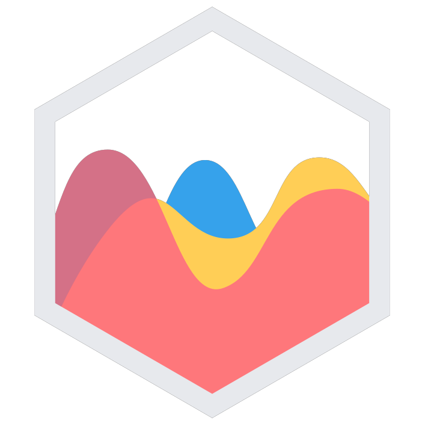
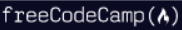

 
Full-stack developer with a commitment to continuous professional
development. I am passionate about creating intuitive web applications and enjoy diving into new engrossing projects. My background in business analysis, banking, and property appraisal gives me a splendid combination of skills and
knowledge, enabling me to take a holistic approach to challenges.

You can find more information regarding my skills and experience in my resume.

Also, you can uncover the set of technologies and tools I experienced with and implemented projects listed below.

I am based in Ottawa, Canada. Feel free to connect with me:

  &nbsp&nbsp&nbsp&nbsp
  &nbsp&nbsp&nbsp&nbsp
  

---

  
Technologies & Tools 🛠️

   
  <table>  
    <tr> <!-- line 1 -->
      <td><strong>Languages:</strong></td>      
      <td align="center" height="108" width="108">
        
         <strong>JavaScript</strong>
      </td>
      <td align="center" height="108" width="108">
        
         <strong>HTML</strong>
      </td>
      <td align="center" height="108" width="108">
        
         <strong>CSS</strong>
      </td>
      <td align="center" height="108" width="108">
        
         <strong>Ruby</strong>
      </td>
      <td align="center" height="108" width="108">
        
         <strong>SQL</strong>
      </td>
    </tr> 
    <tr> <!-- line 2 -->
      <td><strong>Frontend:</strong></td>    
      <td align="center" height="108" width="108">
        
         <strong>React</strong>
      </td>
            <td align="center" height="108" width="108">
        
         <strong>Redux</strong>
      </td>
      <td align="center" height="108" width="108">
        
         <strong>React Router</strong>
      </td>
            <td align="center" height="108" width="108">
        
         <strong>React Query</strong>
      </td>
      <td align="center" height="108" width="108">
        
         <strong>jQuery</strong>
      </td>
    </tr>
    <tr> <!-- line 3 -->
      <td align="center" height="108" width="108">
        
         <strong>Next.js</strong>
      </td>      
            <td align="center" height="108" width="108">
        
         <strong>Bootstrap</strong>
      </td>
      <td align="center" height="108" width="108">
        
         <strong>SASS</strong>
      </td>
      <td align="center" height="108" width="108">
        
         <strong>Tailwind</strong>
      </td>
      <td align="center" height="108" width="108">
        
         <strong>CSS Modules</strong>
      </td>
      <td align="center" height="108" width="108">
        
         <strong>Styled Components</strong>
      </td>
    </tr>
      <tr> <!-- line 4 -->
      <td><strong>Backend:</strong></td>
            <td align="center" height="108" width="108">
        
         <strong>Node.js</strong>
      </td>
      <td align="center" height="108" width="108">
        
         <strong>Express</strong>
      </td>         <td align="center" height="108" width="108">
        
         <strong>MongoDB</strong>
      </td>
      <td align="center" height="108" width="108">
        
         <strong>PostgreSQL</strong>
      </td>
      <td align="center" height="108" width="108">
        
         <strong>Supabase</strong>
      </td> 
    </tr>
    <tr> <!-- line 5 -->
      <td><strong>Databases:</strong></td>
            <td align="center" height="108" width="108">
        
         <strong>React Icons</strong>
      </td>      
      <td align="center" height="108" width="108">
        
         <strong>React Hot Toast</strong>
      </td>
      <td align="center" height="108" width="108">
        
         <strong>date-fns</strong>
      </td>
      <td align="center" height="108" width="108">
        
         <strong>Recharts</strong>
      </td>
      <td align="center" height="108" width="108">
        
         <strong>Chart.js</strong>
      </td>
      </tr>
          <tr> <!-- line 6 -->
            <td align="center" height="108" width="108">
        
         <strong>FusionCharts</strong>
      </td>
            <td align="center" height="108" width="108">
        
         <strong>React Leaflet</strong>
      </td>
      <td align="center" height="108" width="108">
        
         <strong>React Hook Form</strong>
      </td>
            <td align="center" height="108" width="108">
        
         <strong>Three.js</strong>
      </td>
    </tr>     
    <tr> <!-- line 7 -->
      <td><strong>Testing:</strong></td>
      <td align="center" height="108" width="108">
        
         <strong>Cypress</strong>
      </td>
      <td align="center" height="108" width="108">
        
         <strong>Jest</strong>
      </td>
      <td align="center" height="108" width="108">
        
         <strong>Mocha</strong>
      </td>
      <td align="center" height="108" width="108">
        
         <strong>Chai</strong>
      </td>
      <td align="center" height="108" width="108">
        
         <strong>RSpec</strong>
      </td>
    </tr>
    <tr> <!-- line 8 -->
      <td><strong>Design:</strong></td>
      <td align="center" height="108" min-width="108">
        
         <strong>Photoshop</strong>
      </td>
      <td align="center" height="108" min-width="108">
        
         <strong>Figma</strong>
      </td>
      <td align="center" height="108" min-width="108">
        
         <strong>Krita</strong>
      </td>
    </tr>
    <tr> <!-- line 9 -->
      <td><strong>Tools, Code editing etc.:</strong></td>
      <td align="center" height="108" min-width="108">
        
         <strong>Git</strong>
      </td>
      <td align="center" height="108" min-width="108">
        
         <strong>VS Code</strong>
      </td>
      <td align="center" height="108" min-width="108">
        
         <strong>Sublime</strong>
      </td>
      <td align="center" height="108" min-width="108">
        
         <strong>Linux</strong>
      </td>
      <td align="center" height="108" min-width="108">
        
         <strong>Vite</strong>
      </td>
    </tr>
  </table>

---

  
Projects 🔥

<section align="center">
<table bordercolor="#66b2b2">
<!-- 1 project -->
  <tr>
    <tr>
    <td width="50%" bordercolor="#66b2b2" valign="top">
    <h3 align="center">Oasis Backside</h3>

    
      
<strong>React, React Router, React Query, React Hook Form, Supabase, Styled Components, Vite</strong>

      
Oasis Backside is the internal application used inside the hotel to manage bookings, rooms and guests.

    </td>

<!-- 2 project -->
<td width="50%" valign="top">
      <h3 align="center">Pizzolino</h3>

   
    
<strong>React, React Router, Redux, Tailwind CSS, Vite</strong>

    
The application allows users to order pizza fast requiring no user account and no login.

  </td>
  </tr>

<!-- 3 project -->
  <tr>
        <td width="50%" valign="top">
      <h3 align="center">Map-Marker</h3>

   
    
<strong>React, React Router, CSS Modules, React Leaflet, React, Datepicker, Vite</strong>

    
React-based single-page application where users can register all the cities that they have ever traveled to.

  </td>
<!-- 4 project -->
  <td width="50%" bordercolor="#66b2b2" valign="top">
    <h3 align="center">React Quiz</h3>

    
      
<strong>React, Reducer</strong>

      
A little quiz

    </td>
  </tr>
<!-- 5 project -->
  <tr>
    <td width="50%" valign="top">
      <h3 align="center">Pollarizing</h3>

   
    
<strong>JavaScript, HTML, SASS, Bootstrap, Express, PostgreSQL, Chart.js</strong>

    
Application allows users to make a decision by creating polls and voting.

  </td>

<!-- 6 project -->
  <td width="50%" bordercolor="#66b2b2" valign="top">
    <h3 align="center">MythiCare</h3>

    
      
<strong>React, Bootstrap, Node, Express, PostgreSQL</strong>

      
A pet sitting app where you can find or become a sitter for the pets.

    </td>
  </tr>

<!-- 7 project -->
  <tr>
    <td width="50%" valign="top">
      <h3 align="center">Jungle</h3>

   
    
<strong>Ruby on Rails, PostgreSQL, Strap</strong>

    
A mini e-commerce application. Plants and flowers online shop.

  </td>

<!-- 8 project -->
  <td width="50%" bordercolor="#66b2b2" valign="top">
    <h3>PhotoLabs</h3>

    
      
<strong>React, Bootstrap, Node, Express, MongoDB</strong>

      
A React-based SPA that allows users to view photos in different contexts.

    </td>
  </tr>

<!-- 9 project -->
  <tr>
    <td width="50%" valign="top">
      <h3 align="center">Tweeter</h3>

   
    
<strong>HTML, CSS, JS, jQuery, Express, Node</strong>

    
Tweeter is a simple, single-page Twitter clone. 

  </td>

<!-- 10 project -->
  <td width="50%" bordercolor="#66b2b2" valign="top">
    <h3>TinyApp</h3>

    
      
<strong>Node, Express</strong>

      
TinyApp is a full stack web application that allows users to shorten long URLs

    </td>
  </tr>
</table>
</section>

---

  
 I am currently learning 📝 

 
 
  
<strong> ☑️ The MERN Fullstack Guide</strong>&nbsp&nbsp&nbsp
    
     Build fullstack React.js applications with Node.js, Express.js & MongoDB (MERN). Also learn how to add file upload, authentication, authorization and how to deploy your application in different ways to different hosting services.
  

  
<strong> ☑️ Next JS & Open AI / GPT</strong>&nbsp&nbsp&nbsp
    
   Build an SEO-friendly blog post gen app with auth0, GPT, stripe payments, Tailwind, & MongoDB
  

  
<strong> ☑️ Typescript: The Complete Developer's Guide</strong>&nbsp&nbsp&nbsp
    
   Master Typescript by learning popular design patterns and building complex projects. Includes React and Express.
  

---

  
 Completed Cources ✅ 

 

  
<strong> ✅ The Ultimate React Course 2023: React, Redux & More</strong>&nbsp&nbsp&nbsp
     
     Front-end development with React and modern libraries course. Context API, React Query, Redux Toolkit, React Hook Form, Tailwind CSS, CSS Modules, Supabase, React Leaflet, advanced patterns etc.
  

  
<strong> ✅ JavaScript: The Advanced Concepts</strong>&nbsp&nbsp&nbsp
    
   Learn modern advanced JavaScript practices and be in the top 10% of JavaScript developers
  

  
<strong> ✅ JavaScript Algorithms and Data Structures</strong>&nbsp&nbsp&nbsp
   Learn the fundamentals of JavaScript including variables, arrays, objects, loops, and functions. Create algorithms to manipulate strings, factorialize numbers, etc. Also learn two important programming paradigms: Object Oriented Programming (OOP) and Functional Programming (FP).

---

  
Most Used Languages 🎯

   

---

  
 GitHub Stats 📊 

   
  
  

---

  
GitHub Trophies 🏆

---
